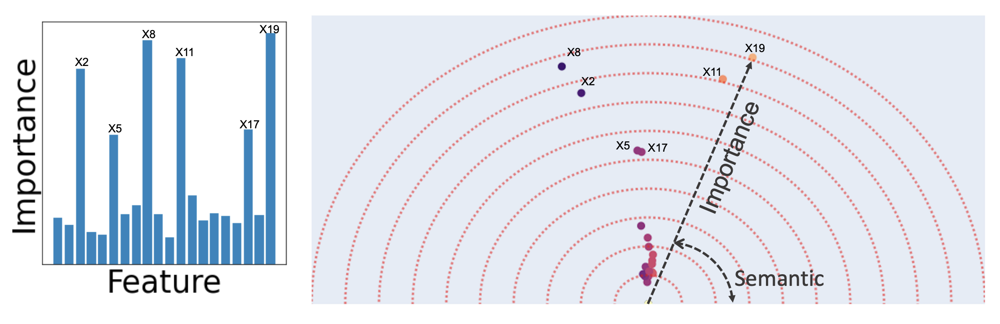
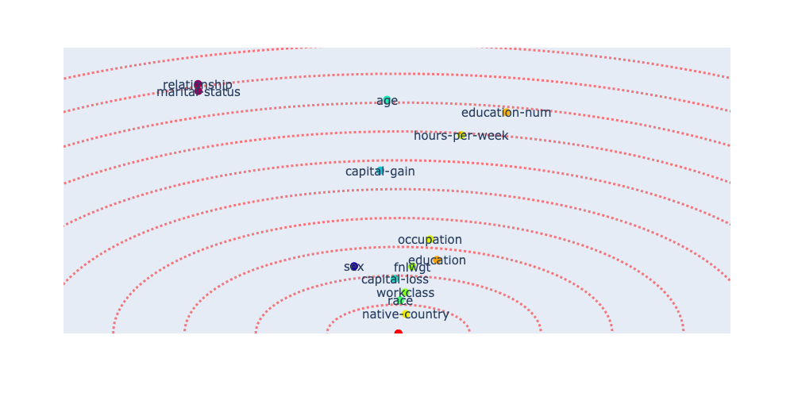

# FeatureVectors

**FeatureVectors** is a unified conceptual explanation algorithm designed specifically for tabular data. This library can be used either to explain a tabular dataset or to explain an existing tree-based machine learning model that are trained on tabular datasets.


a

Existing explainability methods with tabular data provide one-dimensional explanations of the model i.e. feature importance scores. Feature-vectors extends the explanation of tree-based models to two dimensions: one to explain importance of features and the other to explain the semantic relationship of features. 


You can see one example of the FeatureVectors output for the [adult income dataset](https://archive.ics.uci.edu/ml/datasets/adult). We see that the two features of ``martial-status`` and ``relationship``, although have the highest importance (furthest from origin), but in the eyes of the model they are very semantically similar and have the same information (they are replaceable). While the other important feature, ``age``, is semantically different from other features. We can also see that while ``education`` and ``education-num`` are semantically similar, ``education-num`` has much higher feature-importrance.


## Install
You can install the library using `pip install feature-vectors`

Alternatively, you can clone the repository to your computer by using `git clone https://github.com/amiratagh/feature-vectors.git`

## How to use the FeatureVectors library
The "Example.ipynb" file provides a simple example of how to use this library. Let's go over a few use cases here. 
In all the examples bellow we assume there is a dataset object that has a few attributes:
```
dataset.X: dataset inputs (a table) in the format of a numpy array or a pandas dataframe 
dataset.feature_names: list of the names of the features (columns) with the order of appearance in dataset.X
dataset.categorical_features: list of the names of features (columns) in dataset.X that are categorical
dataset.y: the output to be predicted (class label number for classification or value for regression)
```
There are a few ways of using this library:


**Case 1** - The most common way to use this library is when you already have a Random Forest model trained on a dataset and you want to explain it. Assuming you have a trained scikit-learn random forest model ```RF_model```, you can explain the model by passing it with the ```tree_generator``` argument:

```python
from sklearn.ensemble import RandomForestClassifier
from fvecs.featurevec import FeatureVec

RF_model = RandomForestClassifier()
RF_model.fit(dataset.X, dataset.y)

fv = FeatureVec(mode='classify',
                feature_names=dataset.feature_names,
                tree_generator=RF_model)
fv.fit(dataset.X, dataset.y)
fv.plot()
```


**Case 2** - A different use-case is when you have a dataset and you want to explain the feature interactions for a specific random forest architecture (instead of a given trained model) with a maximum tree depth of ```MAX_DEPTH```:
```python
from fvecs.featurevec import FeatureVec

fv = FeatureVec('classify',
                max_depth=MAX_DEPTH,
                max_sentences=MAX_SENTENCES)
fv.fit(dataset.X, dataset.y, categorical_feats=dataset.categorical_featuress)
fv.plot()
```
where ```MAX_SENTENCES``` is the maximum number of decision rules (sum of number of leaves in all trees) you want your model to have.

In order to explain the dataset for the randomized tree architecture discussed in "Friedman 2005 Sec 3.3" (random forests where the tree sizes are random), where average tree depth is ```MAX_DEPTH```, you can do the following:

```python
from fvecs.featurevec import FeatureVec

fv = FeatureVec('classify',
                max_depth=MAX_DEPTH,
                max_sentences=MAX_SENTENCES,
                exp_rand_tree_size=True)
fv.fit(dataset.X, dataset.y, categorical_feats=dataset.categorical_featuress)
fv.plot()
```


Note that in this use case, as the library is internally training a random forest model, you should provide the list of categorical features as "categorical_feats". This will one-hot encode the categorical features and train a scikit-learn Random Forest model on the encoded features. However, for feature-visualization, all the one-hot encoded categories of a column are unified back into one feature vector. Without providing "categorical_feats" (NOT RECOMMENDED), the module will automatically decided which features are categorical by searching for columns that contain string data format. Note that in both cases, the module itself is training a model from scratch. If you already have a trained model that you want to explain, you do not need to pass "categorical_feats" as it will do nothing.

**Case 3** - A more rare use case is when you have a scikit-learn random forest model ```RF_model``` already trained on the dataset. You want to keep the architecture the same but you want the module to retrain it from scratch. For that, you can pass the existing model using ```tree_generator``` argument to the module and set ```restart=True```.

```python
from sklearn.ensemble import RandomForestClassifier
from fvecs.featurevec import FeatureVec

RF_model = RandomForestClassifier()
RF_model.fit(dataset.X, dataset.y)

fv = FeatureVec(mode='classify',
                feature_names=dataset.feature_names,
                tree_generator=RF_model)
fv.fit(dataset.X, dataset.y, restart=True)
fv.plot()
```

## Computing feature vectors condifence bounds using tree bagging
We can compute confidence bounds for the computed feature vectors by sampling with replacement from the trees in the random forest architecture, re-extracting the deicsion rules, and computing the feature vectors for each bag. By passing the ``NUMBER_OF_BAGS`` value we can plot confidence bounds:

```python
from fvecs.featurevec import FeatureVec
fv = FeatureVec(mode='classify',
                feature_names=dataset.feature_names,
                tree_generator=RF_model)
fv.fit(dataset.X, dataset.y, bagging=NUMBER_OF_BAGS) 
fv.plot(confidence=True)

```
